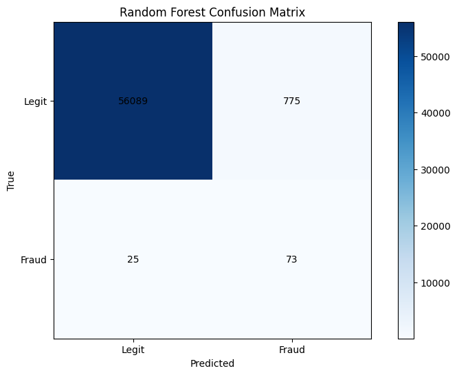
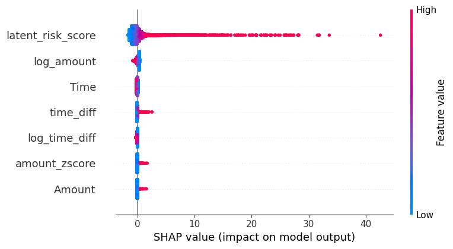

# 🛡️ Financial Fraud Detection System

A robust Machine Learning pipeline designed to detect fraudulent transactions in highly imbalanced datasets. This project prioritizes not just high accuracy, but **explainability** and **precision**, ensuring that genuine users are not flagged while actual fraud is caught. This project implements a "Champion-Challenger" model approach, comparing Logistic Regression (Baseline) against Random Forest (Champion) to optimize for fraud-specific metrics like Precision-Recall AUC.

## 📊 Model Performance & Visualization

### 1. Confusion Matrix
This visualization evaluates the classification accuracy. Given the nature of fraud detection, we prioritize minimizing **False Negatives** (missing a real fraud) while keeping **False Positives** (flagging a legit user) manageable.



> **How to read this:**
> * **Bottom Right:** True Fraud cases successfully detected.
> * **Top Right:** Legitimate transactions incorrectly flagged as fraud (False Alarms).
> * **Bottom Left:** Fraud cases the model missed.

### 2. SHAP Model Explainability
To ensure trust in the system, we use SHAP (SHapley Additive exPlanations) to interpret the model's decisions. This plot reveals which features contributed most to the "Fraud" vs. "Legit" prediction.



> **How to read this:**
> * Features are ranked by importance from top to bottom.
> * **Red** indicates a high value for that feature; **Blue** indicates a low value.
> * Points to the **right** push the prediction toward **Fraud**.
> * Points to the **left** push the prediction toward **Legit**.

---

## 🚀 Key Features

* **Imbalanced Data Handling:** Optimized using Precision-Recall techniques rather than just ROC-AUC.
* **Explainable AI (XAI):** Integrated SHAP analysis to provide reasoning for every prediction.
* **Custom Visualization Stack:** A set of utility functions for generating ROC, PR Curves, and Confusion Matrices instantly.

## 🛠️ Tech Stack

* **Python 3.8+**
* **Scikit-Learn** (Modeling & Metrics)
* **SHAP** (Model Interpretability)
* **Matplotlib & Seaborn** (Data Visualization)
* **Pandas & NumPy** (Data Manipulation)

## 📂 Project Structure

```text
├── data/               # Source datasets
├── src/                # Source code
│   ├── model.py        # Model training script
│   └── plots.py        # Visualization functions (ROC, SHAP, CM)
├── images/             # Saved plot images for documentation
├── README.md           # Project documentation
└── requirements.txt    # Python dependencies
